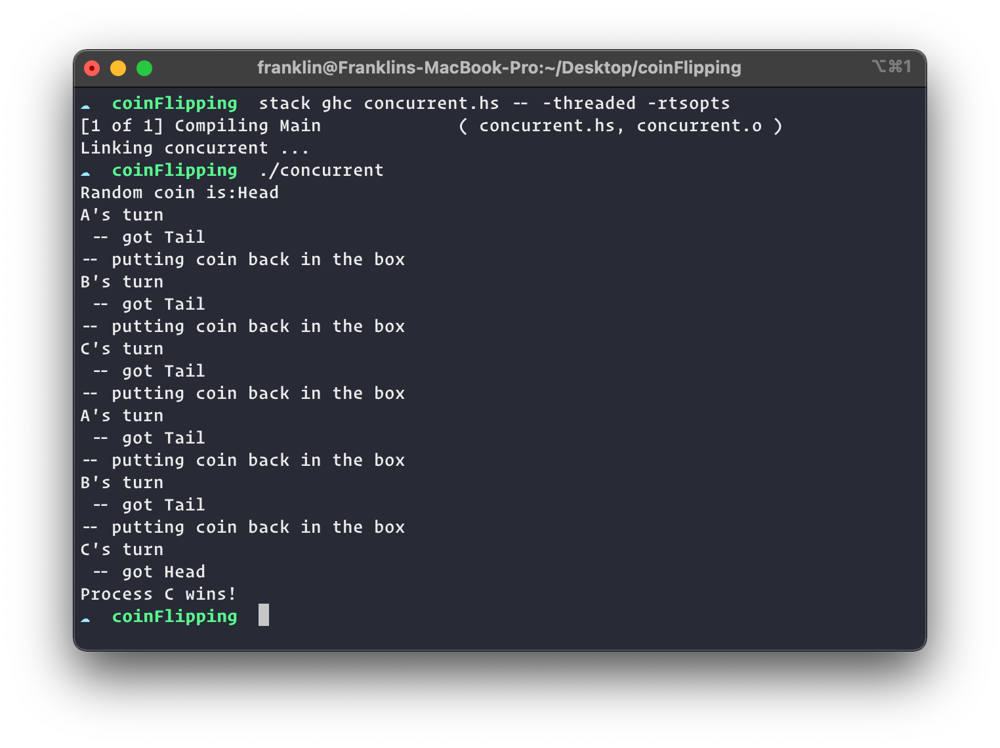

# Coin Flipper

A simple coin flipping game using Haskell's concurrency method.

## Running the program

To compile the program just use the following command

 `stack ghci concurrent.hs -- -threaded -rtsopts'`

and run it by

`./concurrent`
